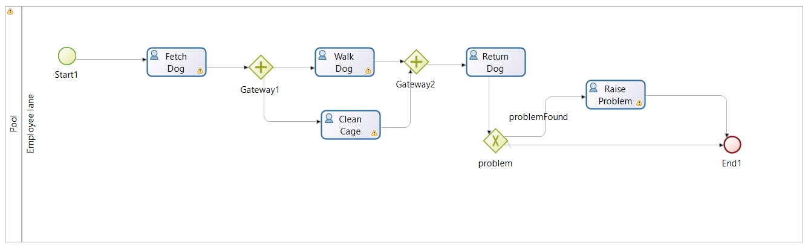

# Simple Bonita Example

This is a simple example of a process-centric application using Bonita. It represents a process for animal attendants to walk dogs at an animal shelter.

This is built with Bonita Community 2024.3.u0. Note that Bonita projects are generally not back-compatible across versions. There is some forward migration support.

This project includes all the basic elements of a bonita workflow application - a data model, UI forms, and the underlying process model. Also note that it is a deliberately partial solution. Contracts are not fully defined. Most activities use the default form - with the exception of *Return Dog* activity, which has an example of a design UI form.

This also serves as an example of using github and Bonita together.

This was created for the IAB321 Business Process Technologies subject at QUT.
